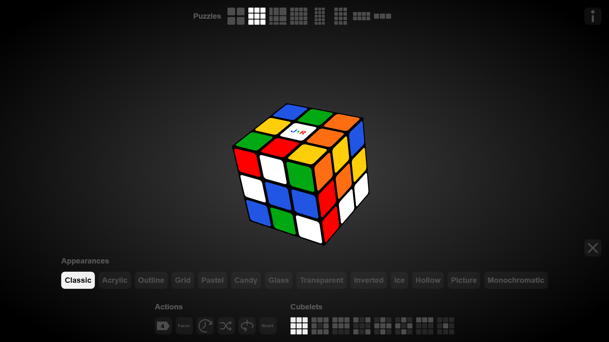
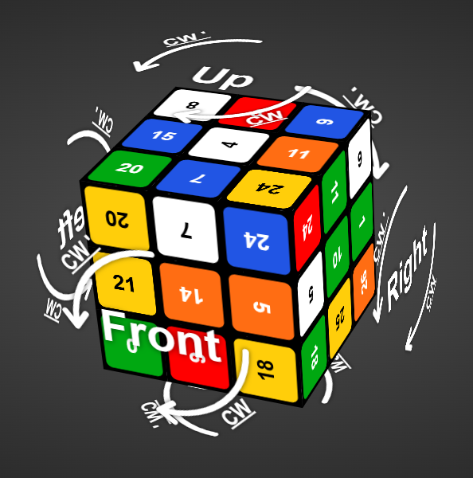
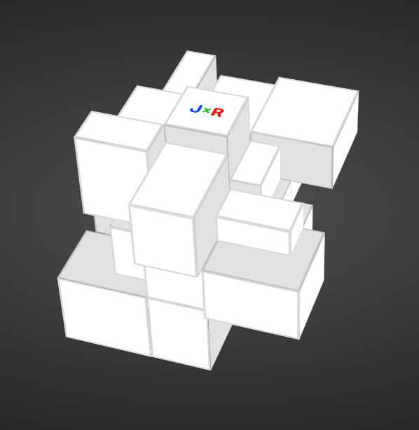
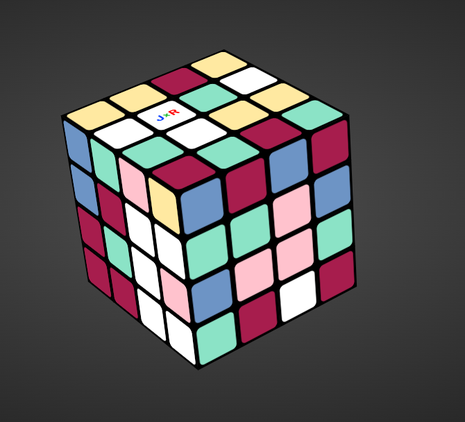
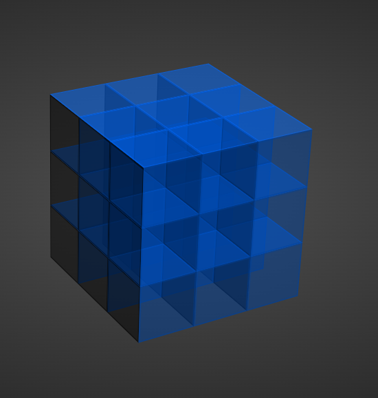
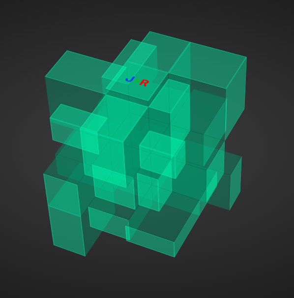
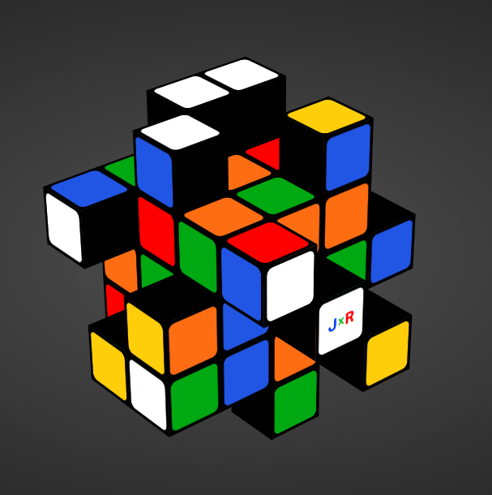
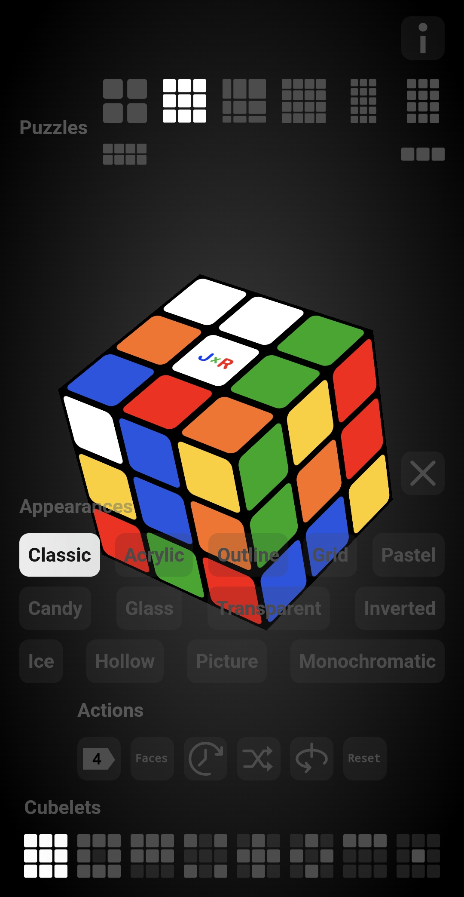

# JxRCube
JxRCube is a 3D puzzle simulator rendered using the DOM. It features gesture-based controls for rotating layers and the puzzle itself, built entirely using HTML, CSS3D, and JavaScript.

**Live demo:** [**JxRCube**](https://jhonyx00.github.io/jxrcube/)

    
     
    <em>Figure 1: JxRCube, selected puzzle: cube3x3x3.</em>

## Table of contents
- [Motivation](#Motivation)
- [Evolution of the project](#evolution-of-the-project)
- [Technology stack](#Technology-stack)
- [Features](#Features)
- [Gallery](#Gallery)
- [Documentation](#documentation)
- [Roadmap](#Roadmap)
- [Author](#Author)

## Motivation
This project was born out of my obsession with mechanical puzzles, I am fascinated by three-dimensional geometry, cubic shapes, and colors, One day I was solving my rubik's 3x3x3 cube and thought "Is there an online simulator?" so I searched the web and there were several and I thought that I could make one too from scratch, which ultimately led me to develop a mini 3D engine that renders mechanical puzzles that respond to on-screen gestures. This project currently features seven puzzles: the 2x2, 3x3, 4x4, 3x3x3 Mirror cube, and the 3x3x4, 4x4x2 and 3x3x5 cuboids. 

## Evolution of the project
At the beginning of development, I implemented a color-swapping system for the cubelets where I simply updated the CSS **background-color** property based on a rotation map for each move and the puzzle cubelets remained static at all times; to rotate a layer, I moved the affected cubelets into a pivot container, rotated the container and finally returned the cubelets to their original positions with their "stickers" swapped. I definied the layers using static index arrays, for example, the "U" layer used indices like "[[0,1,2], [3,4,5], [6,7,8]]", while this aproach worked, it was overly complex for my taste and felt like a "cheat", as the cubelets were never truly rotating, I wanted a simulation that was faithful to reality, it was then that I decided do dive deep into 3D geometry. Through my research, I discovered that, once again, math would save the day ahd there is nothing wrong with trusting them.   

## Technology stack
- HTML
- CSS
- JavaScript

## Features
- Global puzzle rotation
- Layer rotation animations
- Responsive design compatible with most devices
- Appearance selection
- Data persistance via localStorage
    
## Gallery

    
     
    <em>Figure 2: Ilustrative cube (3x3x3 cube).</em>

    
     
    <em>Figure 3: Irregular scramble (3x3x3 mirror).</em>

    
     
    <em>Figure 4: Scrambled candies (4x4 cube).</em>

    
     
    <em>Figure 5: Ice cube (3x3x3 cube).</em>

    
     
    <em>Figure 6: Translucent cube (3x3x3 mirror cube).</em>

    
     
    <em>Figure 7: Visual disaster (3x3x5 cube).</em>

    
     
    <em>Figure 8: Responsive design (3x3x3 cube).</em>

## Documentation
- [Architecture](docs/architecture.md)
- [Linear algebra](docs/linear-algebra.md)
- [Implementation](docs/implementation.md)
- [Optimization](docs/optimization.md)
- [Animations](docs/animations.md)

## Roadmap
- [x] Implement on-screen gesture interaction.
- [x] Model logic state using 4x4 matrices.
- [x] Decouple interaction logic from core functionality.
- [x] Separate static data from class properties. 
- [x] Implement core functionality through custom classes.
- [x] Garbage Collector optimization.
- [ ] Implement solvers for each puzzle.

## Author
Jhonatan Reyes - [@Jhonyx00](https:/github.com/Jhonyx00)