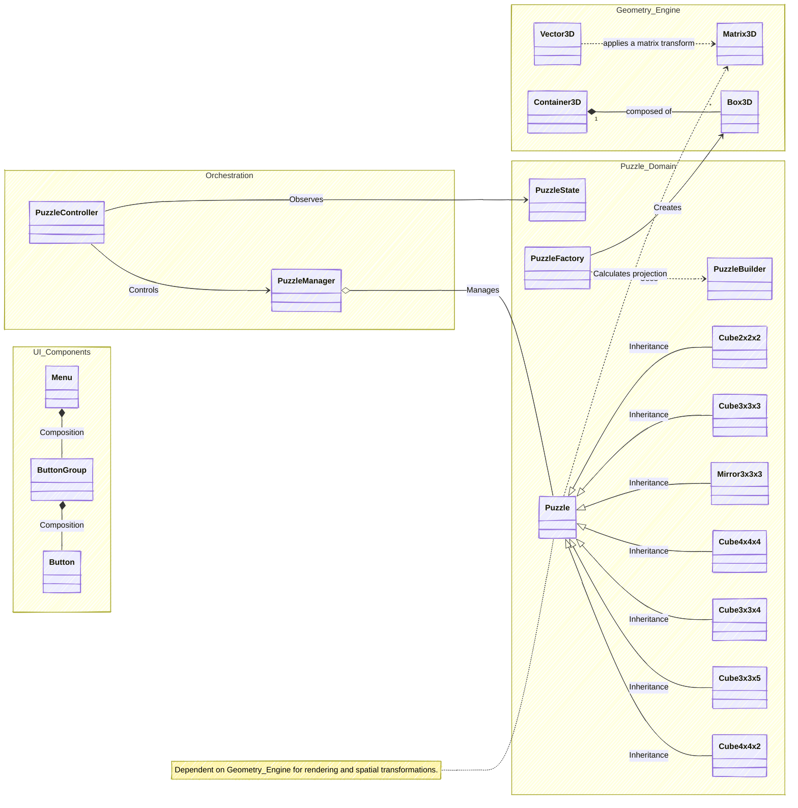
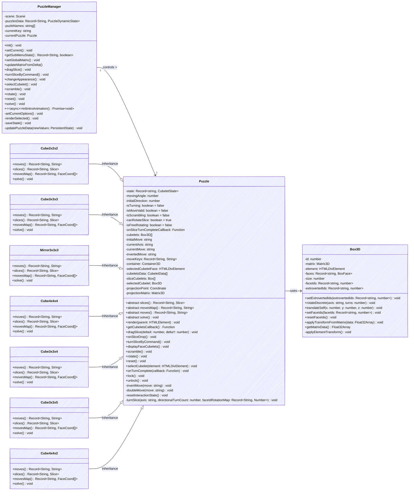

## Architecture

### Index
- [Overview](#overview)
- [Core Classes](#core-classes)
- [Class interaction](#class-interaction)
    - [Build](#build)
    - [UI](#ui)
- [File tree](#file-tree)
- [General structure](#general-structure)
- [Detailed implementation: Puzzle related class](#detailed-implementation-puzzle-related-class)

### Overview
Personally, I am a stickler for (digital) organization and JavaScript's "syntatic sugar" classes. I decided to leverage them to modularize the project into small, purpose-built components, this keeps the architecture clear and straightforward. I focused on designing these classes to be as generic as possible, ensuring they can be utilized even outside the context of 3D puzzles.

### Core Classes
The simulator operates using the following repertoire of classes:

- **Box3D**: Defines a rectangular prism structure using div elements to form the puzzle cubelets. It contains a Matrix3D instance for its transformations in 3D space.

- **BoxFace**: Defines the div element for each face of the prism, including custom attributes and logic for the permutation of IDs and attributes.

- **Container3D**: A general container for the puzzle cubelets that maintains everything within a 3D grid. It holds a Matrix3D instance, which is essential for free rotation of the entire puzzle.

- **Vector3D**: Manages vectors for calculations such as normalization, dot product, and vector-matrix multiplication.

- **Matrix3D**: Manages the matrix logic for both cubelets and containers. Key methods include matrix multiplication, component retrieval, index-based rotations, rotation projection (without updating original data), and string conversion to generate the matrix3d CSS property.

- **Puzzle**: The "brain" of the system. It handles generic logic shared across all puzzles, such as layer dragging, scrambling, resetting, and keyboard command controls.

- **Cube2x2x2**, Cube3x3x3, Cube4x4x4, Mirror3x3x3, Cube3x3x4, Cube3x3x5: Specific classes representing each puzzle, including their move maps, layers, and unique behaviors.

- **PuzzleController**: Manages DOM events for puzzle interaction, such as mousemove, touchstart, etc.

- **PuzzleManager**: Handles actions performed on the currently selected puzzle and manages the initialization of each instance.

- **PuzzleState**: Tracks the general state of the selected puzzle, including start/current drag positions, the status of Ctrl and Shift keys, and the interaction type.

- **PuzzleBuilder**: Responsible for generating the raw data objects representing each Box3D instance.

- **PuzzleFactory**: Instantiates Box3D objects from an array of raw data objects.

- **Scene**: Represents the main container where 3D objects are rendered.

- **Sign3D**: A cubic container for labels (e.g., for rendering face names over their respective sides).

- **SignFace**: Represents each of the six elements that make up a Sign3D.

### Class interaction
The interaction between classes is straightforward. Everything begins with the **PuzzleController** class, which requires three components:
- A **PuzzleState** object (manages the general state of the puzzles).
- A **PuzzleManager** instance (acts as the orchestrator).
- An Initial Callback (executes as soon as the page loads).

The PuzzleManager instance requires two components:
- A Scene object (handles 3D rendering).
- An Initial Data Object containing puzzle instances, such as **Cube3x3x3**.

The **Cube2x2x2**, **Cube3x3x3**, **Cube4x4x4**, **Mirror3x3x3**, **Cube3x3x4**, **Cube4x4x2** and **Cube3x3x5** classes inherit from Puzzle (the "brain"). Internally, they require a Container3D instance (a group for 3D elements) where the Box3D cubelets are stored.

#### Build
The **PuzzleManager** class includes an initialization method that runs once at startup to set everything in motion. This process involves interaction with two additional classes:

A method from the static **PuzzleBuilder** class (Raw Data Construction) to generate the raw data for the cubelets.

A method from the static **PuzzleFactory** class (3D Element Construction) to instantiate the **Box3D** objects for each puzzle.

The **Box3D** class only requires instances of BoxFace (2D elements) for its construction.

#### UI
Interaction with the simulator is handled through a menu in the user interface generated by the **Menu** class. This class requires **ButtonGroup** objects for sub-sections such as "controls" or "puzzles." Each **ButtonGroup**, in turn, requires** Button** objects, which represent the actual buttons displayed on the screen.

### File tree
The file structure reflects the project's modular architecture, enabling the development of new puzzles or additional logic while ensuring scalability and maintainability.

<pre>
├───docs                          # .md files for documentation.
├───public
│   ├───icons                     # UI icons
│   │   ├───controls              # .svg files for "controls" options icons
│   │   ├───cubelets              # .svg files for "cubelets" options icons
│   │   └───main                  # Main button icons
│   │   └───puzzles               # Icons for the "puzzles" section
│   ├───images                    # Vector images
│   │   ├───appearances           # Vectors\ images for puzzle appearances
│   │   │   ├───color_based       # .svg files foto be rendered on the regular cubelets
│   │   │   └───shape_mod         # .svg files for mirror 3x3x3 cubelet rendering
│   │   ├───bases                 # .svg files for puzzle cubelets rendering
│   │   └───readme                # Images used in the README.md file
│   └───styles
│       ├───appearances           # .css files mapping external images to cubelets
│       └───bases                 # .css files mapping internal images to cubelets
│       ├───components            # .css files for UI components
│       ├───core                  # .css files for the rendering engine
│       ├───puzzle                # .css files for cubelet styling
└───────index.html                # Main HTML entry point
└───src
│   ├───core                      # Core engine and logic
│   │   ├───engine                # .js files that powers the simulator
│   │   └───ui                    # .js files for UI components
│   ├───data
│   │   ├───puzzle                # Global data consumed by puzzle classes
│   │   └───ui                    # Data for dialogs and dynamic icon URLs
│   ├───puzzles                   # .js files modeling specific puzzles
│   │   ├───cube2x2x2             # 2x2x2 cube model
│   │   ├───cube3x3x3             # 3x3x3 cube cube model
│   │   ├───cube3x3x4             # 3x3x4 cuboid cube model
│   │   ├───cube3x3x5             # 3x3x5 cuboid model
│   │   ├───cube4x4x4             # 4x4x4 cube model
│   │   └───mirror3x3x3           # 3x3x3 mirror cube model 
│   │   └───cube4x4x2             # 4x4x2 cuboid cube model 
|   └───types                     # .js files for type definitions.
|   └───main.js                   # Main javascript entry point
└───README.MD                     # Main documentation
</pre>

### General structure
The simulator is divided into four main modules: **Orchestration**, **Geometry Engine**, **Puzzle Domain**, and **UI Components**.

- **Orchestration**: Manages the application's lifecycle and coordinates the interaction between the logic and the view.
- **Geometry Engine**: Handles 3D transformations, matrix mathematics, and vector calculations for rendering.
- **Puzzle Domain**: Contains the business logic for each specific puzzle, defining moves, internal states, and permutations.
- **UI Components**: Manages the visual interface, menus, and user-facing interaction elements.

### Detailed implementation: Puzzle related class
The **Puzzle** class is the most complex in terms of functionality; it serves as the central hub where all other classes interact, and it relies on them to achieve full operational capability.

The following diagram illustrates the core classes of the simulator. For the sake of clarity, several attributes and methods from the **PuzzleManager**, **Puzzle**, and **Box3D** classes have been omitted.

