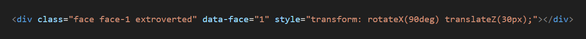
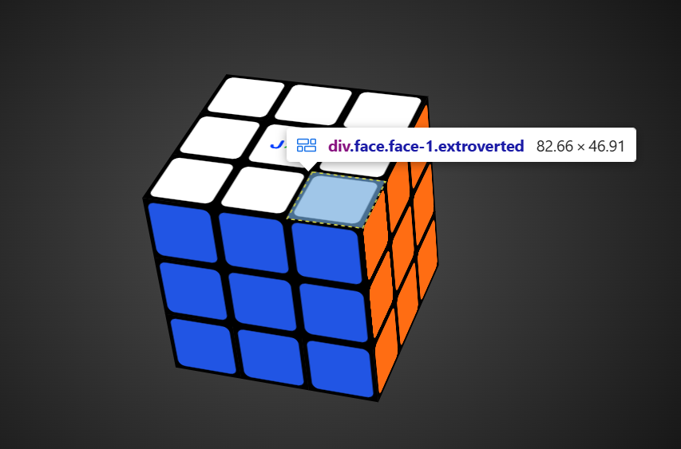
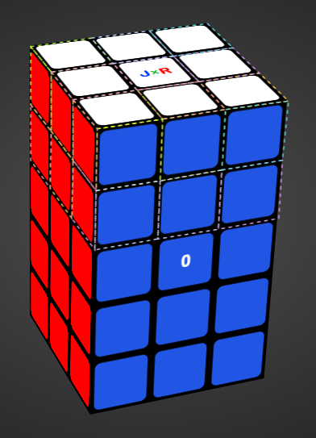
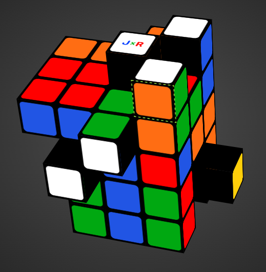
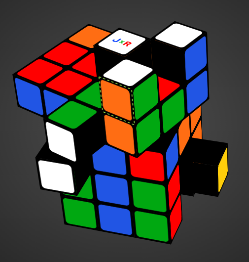

## Implementation

### Index
- [How a slice turning works?](#How-a-slice-turning-works)
- [Slice turning in depth](#slice-turning-in-depth)
    - [Get data-face](#get-data-face)
    - [Gesture length](#gesture-length)
    - [Projection point](#projection-point)
    - [Current direction](#current-direction)
    - [Current axis](#current-axis)
    - [Translation component index](#translation-component-index)
    - [translation component](#translation-component)
    - [Grid position](#grid-position)
    - [Initial move](#initial-move)
    - [Filter callback](#filter-callback)
    - [Slice object](#slice-object)
    - [Special case: cube3x3x5](#special-case-cube3x3x5)
    - [Current move](#current-move)
    - [Drag angle](#drag-angle)
    - [Temporary transformation](#temporary-transformation)
    - [Keeping the system discrete](#keeping-the-system-discrete)
    - [Data persistance](#data-persistance)

### Overview
The simulator operates strictly under the principles of linear algebra. Each cubelet is governed by a 4x4 matrix that defines its position and rotation in 3D space. For the initial rendering, each cubelet starts with an identity matrix, and its unique position is assigned by modifying only the translation components of the matrix. I chose to use 4x4 matrices because the Rubik's Cube can be viewed as a discrete, closed system (when no layers are in motion). Mathematically, the cubelets are represented as a set of 4x4 matrices within a 3D grid, where only the affected matrices are updated after each turn. One key optimization is that trigonometry is not strictly required to calculate the final state matrices. Since the puzzle's rotations are always defined by cardinal angles ($0^\circ, 90^\circ, 180^\circ, 270^\circ$), calculating sines and cosines invariably results in $0$, $1$, or $-1$. Consequently, I substitute these values directly into the fundamental rotation formulas when updating the matrices post-turn. This ensures that the puzzle's internal state always maintains integer-based matrix values, avoiding **floating-point errors** and keeping the system mathematically "clean."

#### How a slice turning works?
In simple terms, rotating a layer (a "slice") follows these steps:

**drag phase**:
- **Detection**: Identify the custom attribute of the selected cubelet face to access its underlying data.
- **Gesture Length**: Calculate the overall magnitude or length of the user's gesture.
- **Projection & Axis Determination**: Using the on-screen drag and gesture length, calculate the dot product (x, y) to obtain the projection point. From this point:
    - **Define a Dominant Axis**: Determine which axis (X or Y) the gesture primarily aligns with.
    - **Define Direction**: Establish the positive or negative direction along that dominant axis.
    - **Define Movement**: Map the direction to a specific puzzle move.
    - **Layer & Filter**: Retrieve the specific layer index and the filter callback associated with movement.
    - **Drag Angle**: Calculate the rotation angle based on the projection point, direction, gesture length and sensitivity settings.
- **Transformation**: Iterate through the affected cubelets and calculate a temporary transformation matrix for each one, based on the current drag angle.

**drop phase**:
- **Auto-Alignment Animation**: Trigger the LERP-based auto-alignment animation to snap the layer to the nearest cardinal position.
- **Discrete Matrix Assignment**: Assign discrete, integer-based matrices to the affected cubelets to maintain the integrity of the closed system.
- **Data Persistence**: Commit and store the updated cubelet matrices to localStorage for state persistence.
- **Interaction Reset**: Reset all interaction flags and boolean variables to prepare for the next gesture.

#### Slice turning in depth
During the layer drag phase, trigonometry is required because the rotation angle directly depends on the on-screen displacement. To render the rotation animation, the system must calculate a new transformation matrix for every cubelet within the active layer at the current drag angle. Consequently, during this phase, cubelets are assigned temporary matrices with floating-point values.

The process for rotating a layer is as follows:

##### Get data-face
Using HTML elements for rendering provided a significant architectural advantage: it eliminated the need for complex raycasting algorithms. Instead, I utilized custom **data-*** attributes to define a unique identifier for each face of every cubelet. The faces are indexed as follows:
- 0 - Front
- 1 - Up
- 2 - Right
- 3 - Back
- 4 - Left
- 5 - Down

I established this specific order by visualizing a white cube on a table, illuminated by a light source positioned above, slightly to the front, and subtly to the right. In this model, the **Front face (0)** receives a little bit of light, the **Up face (1)** receives the most light, followed by the **Right face (2)**. The **Back face (3)** is lit by simulated bounce light from an imaginary rear wall, while the **Left (4)** and **Down (5)** faces receive the least illumination, with the latter serving as the base.

When a cubelet is selected, the system retrieves the data-face attribute, for example, data-face="1" from cubelet #8 to identify the interaction point.

<p align="center">
    
    <br>
    <em>Figure 9: Custom attribute 'data-face'.</em>
</p>

<p align="center">
    
    <br>
    <em>Figure 10: Cubelet selection representation.</em>
</p>

##### Gesture length
During the mousemove, pointermove or touchmove event, the gesture lenght (magnitude) is calculated:
```javascript
const gestureLength = Math.hypot(deltaX, deltaY);
```
inmediately, the normalized vector components are calculated:

> **Mathematical Context:** The calculation of the direction vector components within this code block is detailded in the [Input vector normalization](linear-algebra.md#Input-Vector-normalization) section
```javascript
// dx and dy are parameters from the "dragSlice" method.
const gestureDirX = dx / gestureLength;
const gestureDirY = dy / gestureLength;
```

##### Projection point
Once the 5-pixel threshold is exceeded (the minimum displacement required to trigger a turn), the system calculates the 2D projection point on the selected puzzle face.

To calculate this point, the gesture direction in both the "X" and "Y" axes is first determined by dividing deltaX and deltaY by the gesture length. Subsequently, a pair of normal vectors is retrieved based on the selected face. These vectors define a unit value on the corresponding axis for a 2D drag plane (the puzzle face). For instance, for Face 0, the normal vector pair would be:

- x -> (0, 1, 0): A horizontal drag ("x") moves cubelets along the **Y-axis**.
- y -> (1, 0, 0): A vertical drag ("y") moves cubelets along the **X-axis**.

After obtaining the normal vectors, the operation V · M (Vector-Matrix multiplication) is performed for both. Here, V represents the normal vector of the selected face for the X and Y axes. The resulting values are then normalized in 2D (using only the X and Y components) to calculate a drag percentage. This ensures the layer can be dragged from any visible area of the face—even if only 1px of the selected face is visible, the interaction remains consistent.

Finally, the dot product is calculated using these normalized values and the gesture direction:

> **Mathematical Context:** The dot product calculation within this code block is detailed in the [Dot product](linear-algebra.md#Dot-product) section.
```javascript
out.x = faceNormal.x.dotNormalized2D(gestureDirX, gestureDirY);
out.y = faceNormal.y.dotNormalized2D(gestureDirX, gestureDirY);
```

##### Current direction
Once the projection point is calculated, the system must determine the direction to lock the axis of rotation. This is achieved by evaluating the sign of the dominant axis (the axis with the greatest magnitude).

The direction is used to define the final movement during the drag phase—for example, distinguishing between "R" and "R'". Just like a physical cube, the "R" layer can be rotated from its resting state in either a clockwise or counter-clockwise direction.
```javascript
const direction = this.#currentAxis === Puzzle.AXES.x 
    ? Math.sign(this.#projectionPoint.x) 
    : Math.sign(this.#projectionPoint.y);
```

##### Current axis
The active rotation is determined by comparing the absolute value of the projection point coordinates. By identifying the axis with the gratest magnitude, the system effectively "locks" the movement to the most significant drag direction and assigns the correct layer. 

```javascript
// Axis locking: Determine the dominant drag axis based on maximum magnitude.
const currentAxis = Math.abs(this.#projectionPoint.x) > Math.abs(this.#projectionPoint.y) ? AXES.x : AXES.y;
```

##### Translation component index
The translation index corresponds to the X, Y or Z  translation components within the cubelet's 4x4 matrix (specifically at indices 12, 13 or 14). This index is retrieved based on the selected face and the active rotation axis using a specialized mapping object.

```javascript
static #FACE_TO_TRANSLATION_INDICES = {
    0: { x: 12, y: 13 },
    1: { x: 14, y: 12 },
    2: { x: 14, y: 13 },
    3: { x: 12, y: 13 },
    4: { x: 14, y: 13 },
    5: { x: 14, y: 12 },
}
```

```javascript
const translationIndex = Puzzle.#FACE_TO_TRANSLATION_INDICES[this.#selectedCubeletFace][currentAxis];
```

##### translation component
The specific translation component is retrieved from the cubelet's 4x4 matrix using the previously determined index.
```javascript
// Access the raw matrix data to get the coordinate along the active axis (X, Y or Z)  
const translationComponent = this.#selectedCubelet.matrix.data[translationIndex];
```

##### Grid Position
The system retrieves the positional index of the cubelet. The property **this.#selectedCubelet.size** indicates that the cubelet is a perfect cube; this condition holds true for all puzzles except for shape-shifting puzzles like the **3x3 Mirror Cube**.

```javascript
const gridPosition = this.#selectedCubelet.size ? translationComponent / this.cubeletSize : Math.sign(translationComponent);
```

##### Initial move
To determine the initial move, the system accesses a mapping object that encapsulates the movement logic based on the selected face, the dominant axis, the positional index, and the drag direction.

The **initialMove** is retrieved through a multi-level movement map using the following hierarchy:
- **Face Index**: The primary key is the cubelet's face identifier (data-face).
- **Dominant Axis**: The second level corresponds to the primary drag axis ("X" or "Y").
- **Positional Index**: The third level uses the cubelet's coordinate within the grid. For example, for a standard 3x3 cube, these indices are restricted to $-1$, $0$, or $1$.
- **Direction**: Finally, the specific move is selected based on the drag direction. Depending on the orientation of the selected face, a clockwise rotation may be mapped to either $-1$ or $1$.
```javascript
const N_3_MOVES_MAP = {
    0: {
        x: {
            [-1]: { 
                1: "L", 
                [-1]: "L'" 
            },
            0: { 
                1: "M", 
                [-1]: "M'" 
            },
            1: { 
                1: "R'", 
                [-1]: "R" 
            },
        },
        y: {
            [-1]: { 
                1: "U'", 
                [-1]: "U" 
            },
            0: { 
                1: "E", 
                [-1]: "E'" 
            },
            1: { 
                1: "D", 
                [-1]: "D'" 
            }
        },
    },
    // 1, 2, 3, 4, 5
}
```
```javascript
this.#initialMove = this.movesMap[this.#selectedCubeletFace][currentAxis][gridPosition][direction];
```

##### Filter callback
The final step of the initial drag is retrieving the filter callback by invoking the **getCubeletsCallback** method.
```javascript
const cubeletsCallback = this.getCubeletsCallback(this.#initialMove, translationComponent);
this.#sliceCubelets = this.#cubelets.filter(cubeletsCallback);
```

The getCubeletsCallback method is designed to be overridden by child classes. This allows for specialized logic to determine the specific boolean criteria for each puzzle type, using the move and translationComponent parameters. In the case of a standard 3x3 cube, the second parameter is not required since it is a symmetrical $N\times N\times N$ puzzle.
```javascript
getCubeletsCallback(move, translationComponent) {
    return this.slices[move].callback;
}
```
##### Slice object
The slices object is provided by a getter in the child class, referencing a local configuration file that contains the necessary data to process a layer rotation. This data allows the engine to utilize **Matrix3D** methods, such as **projectRotation**, to apply a visual transformation without modifying the discrete internal data of the affected cubelets' matrices.

The callback returns a boolean value to filter cubelets based on specific conditions. To ensure the filtering works regardless of the cubelet's size, the system accesses the cubelet's matrix through a getter called unitY, which returns the sign of the specified translation component. The structure is as follows:
```javascript
const N_3_SLICES = {
    "U": {
        axis: "y",
        direction: -1,
        callback: cubelet => cubelet.matrix.unitY === -1
    },
    /// U', R, D, etc.
}
```

##### Special case: Cube3x3x5
To understand how the getCubeletsCallback method functions for $N \times N \times M$ puzzles (such as the 3x3x5), one must first visualize its internal structure. This puzzle can be viewed as a standard 3x3 cube with an additional layer both above and below it. Consequently, the grid units no longer range from $-1$ to $1$; they extend from $-2$ to $2$, including the origin ($0$). 

The **getCubeletsCallback** method first validates the matrix component value. If no value is detected, the engine identifies the target as an internal layer. However, if a value exists, it is categorized as an external layer.

For external layers, the system performs a cubelet count validation. According to the mechanical constraints of a physical cuboid, if a layer contains fewer than 9 cubelets, it cannot be rotated independently. In such cases, the method returns a specialized fallback callback that captures the cubelets from the adjacent layer, ensuring the simulation adheres to real-world physical restrictions.
```javascript
getCubeletsCallback(move, translationComponent) {
    const externalSlice = translationComponent
        ? this.slices[this.#changeMove(move)]
        : undefined;

    if (externalSlice) {
        const filteredCubeletsSize = super.getFilteredCubeletsSize(externalSlice.callback);

        if (filteredCubeletsSize < 9)
            return this.specialCallbacks[move[0]];
        else
            return this.slices[move].callback;
    }
    else  // internal slice
        return this.slices[move].callback;
}
```
The **specialCallbacks** object contains methods that utilize comparison operators (greater than or less than) to encompass a broader range of cubelets. To achieve this, the **getGridUnitY** method is used to retrieve a value corresponding to the cubelet's scale factor. For instance, if the result is $< 0$, the filter identifies all cubelets positioned above index $0$:

```javascript
class Cube3x3x5 extends Puzzle {
    get specialCallbacks() {
        return SPECIAL_CALLBACKS;
    }
    // ... additional logic
}
```
```javascript
const SPECIAL_CALLBACKS = {
    "U": cubelet => cubelet.matrix.getGridUnitY(cubelet.size) < 0,
    // ... other mappings
}
```

<p align="center">
    
    <br>
    <em>Figure 11: Cubelets < 0</em>
</p>

A practical example occurs when attempting to drag the top layer ($index = -2$) from right to left, starting from the **white-orange-green** cubelet. If the system detects only 3 cubelets in that specific plane, it recognizes that this is below the 9-cubelet threshold required for a valid rotation. To adhere to physical cuboid constraints, the engine automatically includes the cubelets from the layer below, ensuring the move remains mechanically possible.

<p align="center">
    
    <br>
    <em>Figure 12: Scrambled 3x3x5 cube.</em>
</p> 

<p align="center">
    
    <br>
    <em>Figure 13: 3x3x5 Cube turninrg.</em>
</p>

##### Current move
During the drag interaction, the system constantly evaluates the final movement. The primary move is established during the initial displacement, and its inverse is defined simultaneously. To optimize performance and ensure consistency, this logic is restricted to execute only once per interaction event using a flag (control variable). Subsequent updates during the drag such as layer selection and rotation angle calculations rely on these predefined values.

```javascript
/**
 * Determines the current move based on whether the drag direction matches the initial gesture.
 */
const currentMove = this.#initialDirection === direction 
    ? this.#initialMove 
    : this.#invertedMove;
```

##### Drag angle
The drag angle is determined by calculating the product of the projection point, the gesture length, the current direction, and the pre-defined sensitivity.
```javascript
/**
 * Calculates the real-time rotation angle based on the dominant axis and gesture magnitude. 
 */
const movingAngle = this.#currentAxis === AXES.x
    ? this.#projectionPoint.x * gestureLength * direction * sensitivity
    : this.#projectionPoint.y * gestureLength * direction * sensitivity;
```

##### Temporary transformation
To perform temporary transformations, the system utilizes a **Float32Array** called **dynamicMatrixData**. This array is initialized with zeros and populated with data retrieved from the layer object:

```javascript
const slice = this.slices[currentMove];

this.#sliceCubelets.forEach(cubelet => {
    const matrixCubeletData = cubelet.matrix.data;
    projectionMatrix.projectRotation(
        this.#dynamicMatrixData, 
        matrixCubeletData, 
        slice.axis, 
        slice.direction * movingAngle
    );
    cubelet.applyTransformFromMatrix(this.#dynamicMatrixData);
});
```

Internally, the rotation projection sets the matrix data as a rotation matrix for the specified axis and angle. It then performs a matrix multiplication between the cubelet's matrix and this rotation matrix:

> **Mathematical Context:** The rotation matrix calculation and multiplication within this code block are detailed in the [Matrix multiplication](linear-algebra.md#Matrix-multiplication) section.

```javascript
/**
 * Projects a temporary rotation without modifying the matrix.
 */
projectRotation(out, m, axis, angle) {
    this.#setRotation(axis, angle, true);
    return Matrix3D.multiply(out, m, this.#data);
}
```

The **applyTransformFromMatrix** method directly updates the element's inline **transform** style using a matrix3d() string populated with the dynamic matrix data:

```javascript
/**
 * Synchronizes the visual DOM element with the given matrix data. 
 */
applyTransformFromMatrix(data) {
    this.#element.style.transform = `matrix3d(${data})`;
}
```

##### Keeping the system discrete
Once the drag interaction concludes, the internal logical data for the affected cubelets' matrices are updated via the **turnSlice** method. This process iterates through all affected cubelets, performs a face ID permutation for each cubelet, and applies the final matrix transformation:

```javascript
#turnSlice(axis, directionalTurnCount, faceIdRotationMap) {
    this.#sliceCubelets.forEach(cubelet => {
        cubelet.setFaceIds(faceIdRotationMap);
        cubelet.rotateDiscrete(axis, directionalTurnCount);
        this.#state[cubelet.id] = { 
            faceIds: cubelet.faceIds,
            matrix: cubelet.getMatrixData() 
        }; 
    });
}
```

For improved code readability, the **rotateDiscrete** method is implemented in both the **Box3D** and **Matrix3D** classes. Within the **Box3D** class, the method first invokes its namesake in the **Matrix3D** class to update the matrix data via multiplication:

```javascript
rotateDiscrete(axis, turns) {
    this.#matrix.rotateDiscrete(axis, turns);
    this.#applyElementTransform();
}
```

The **rotateDiscrete** method in the Matrix3D class performs the transformation using static matrices avoiding trigonometric functions to ensure integer-based precision. The **multiplySelf** method then modifies the internal data by multiplying the current state with the specific rotation matrix for the given axis and number of turns:

> **Mathematical Context:** The rotation matrix calculation and multiplication within this code block are detailed in the [Matrix multiplication](linear-algebra.md#Matrix-multiplication) section.


```javascript
/**
 * Updates the matrix data using pre-calculated static rotation matrices.
 */
rotateDiscrete(axis, turns) {
    const R = this.#DISCRETE_MATRIX_ROTATIONS[axis][turns];
    this.#multiplySelf(R);
}
```

Finally, the visual transformation is applied by assigning the calculated values to the element's inline **transform** property.

```javascript
#applyElementTransform() {
    this.#element.style.transform = `${this.#matrix.toCSSString()}`;
}
```

Upon completion, all cubelets maintain discrete matrices, for example: **matrix3d(1, 0, 0, 0, 0, 1, 0, 0, 0, 0, 1, 0, 60, -60, 60, 1);**.

##### Data persistance
To finalize the core functionality, the current state of the puzzle is stored in localStorage. This ensures data persistence, allowing users to close the application without losing their progress:

```javascript
/**
 * Persists the current puzzle state to local storage using a unique puzzle key.
 */ 
localStorage.setItem(`jxrcube:${this.#currentKey}:state`, JSON.stringify(this.#currentPuzzle.state));
```